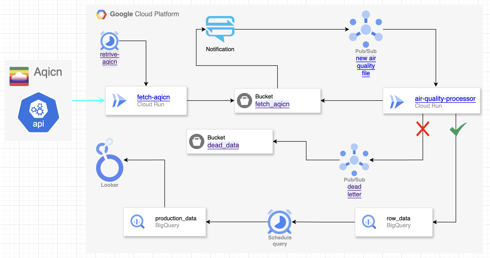
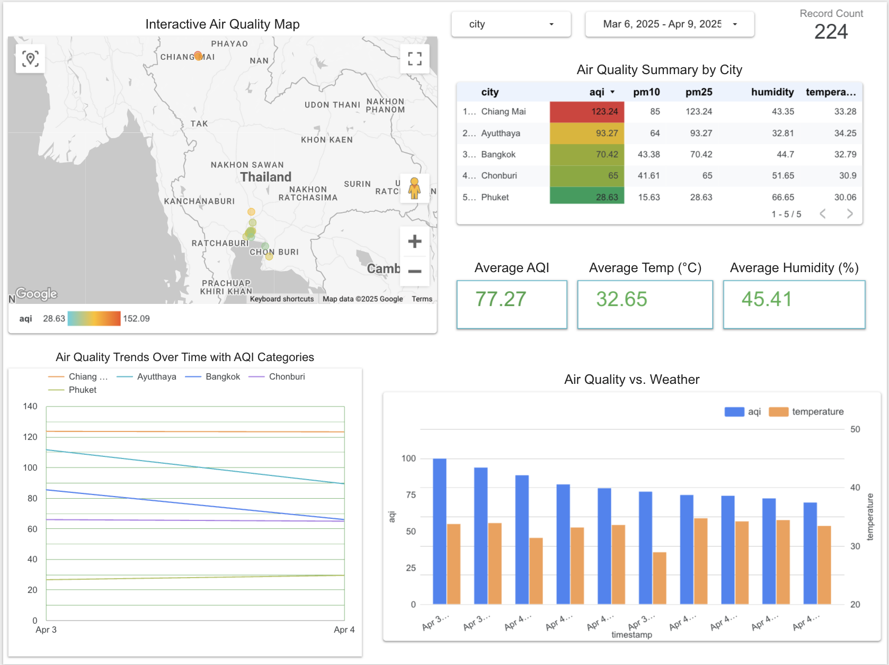

# Environmental Monitoring System

## 🌎 Overview

This project is a fully automated air quality monitoring system built on Google Cloud Platform. It collects, processes, and visualizes environmental data in near real-time, making it easy to track air quality metrics across different locations around Thailand because of high level air pollution.

## 🏗️ Architecture

The system follows a modern cloud-native serverless architecture:

### Data Collection

- **Fetch-AQICN Service**: A Cloud Run service that retrieves air quality data from the AQICN API
- **Cloud Scheduler**: Triggers the data collection at regular intervals

### Data Pipeline

1. ELT batch processing
2. Data is fetched and stored temporarily in a Cloud Storage bucket (`fetch_aqicn`)
3. A Pub/Sub notification is triggered when new data arrives
4. The `air-quality-processor` service is automatically invoked to clean and transform the data
5. Processed data is loaded into BigQuery tables for analysis

### Error Handling

- Failed processing attempts are sent to a dead-letter queue
- Error data is stored in a separate bucket (`dead_data`) for troubleshooting

### Data Analysis & Visualization

- Scheduled queries update production tables with the latest processed data
- Looker dashboards provide real-time visualization of air quality trends
- [View our real-time dashboard](https://lookerstudio.google.com/reporting/8463a27b-c8c2-4d20-b3ee-5128ea78a58a)

## 💻 Tech Stack

- **Google Cloud Run**: Serverless container execution
- **Google Cloud Scheduler**: Automated job scheduling
- **BigQuery Scheduled Queries**: Automated data transformation
- **Cloud Storage**: Data staging and error storage
- **Cloud Pub/Sub**: Event-driven messaging
- **BigQuery**: Data warehousing and analytics
- **Looker**: Data visualization and dashboarding

## 🚀 Key Features

- **Fully Automated**: The entire pipeline runs without manual intervention
- **Scalable**: Handles varying data volumes efficiently
- **Reliable**: Robust error handling prevents data loss
- **Real-time**: Updates data and visualizations frequently
- **Cost-effective**: Serverless architecture only charges for actual usage

## 🔍 Use Cases

- Environmental health monitoring for Thailand
- Tracking pollution trends over time
- Supporting public health research
- Educational tool for environmental science students

---

This project demonstrates cloud architecture design, serverless computing, data pipeline engineering, and data visualization skills - all using modern Google Cloud Platform services.
